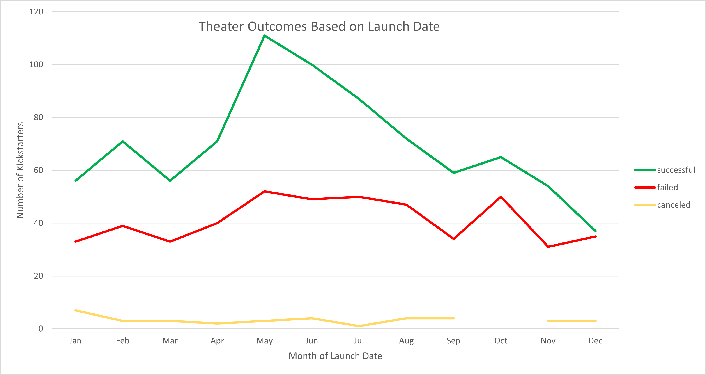
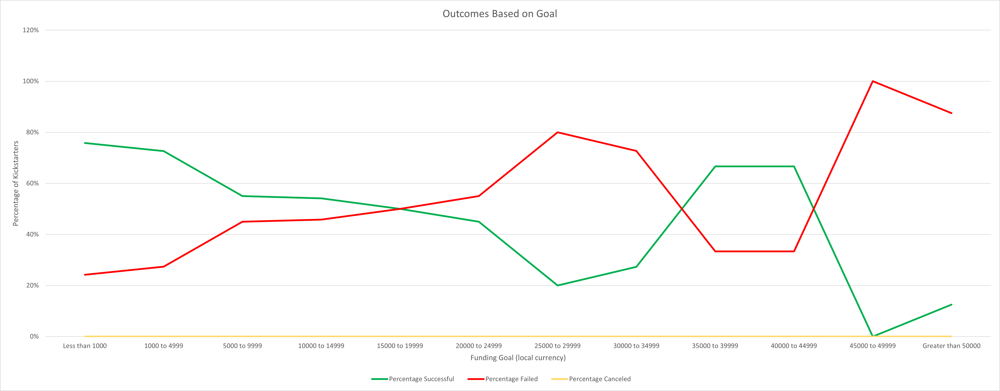

# Kickstarting with Excel

## Overview of Project
In this analysis, I have examined the campaign outcomes of theater and play kickstarters based on their launch date and funding goal look for trends that determine whether they succeed or fail. 

### Purpose
By examining if theater and play kickstarters succeed or fail based on their launch dates and funding goals, we can see if there are trends across parameters to best direct our efforts in future fundraisers, like we did for *Fever* playwright Louise when she wanted help determining specific factors in fundraising campaign success to best guide her own campaign. 

## Analysis and Challenges
Using crowdfunding data available from the Kickstarter spreadsheet, I was able to extract the relevant fundraisers to our question - *Does the launch date or funding goal impact the success of theater and play fundraising campaigns?*

Data provided for this analysis included over 4100 fundraising campaigns, around 1300 of which were about theater, and over 1000 of those were about plays, giving us a decent sample size in order to compare campaigns based on their launch date and their funding goal. Microsoft Excel was used for all analyses.

### Analysis of Outcomes Based on Launch Date
In order to analyze the campaign success based on launch date, I created a pivot table that filtered by parent category, allowing me to filter only theater kickstarters (which includes plays, musicals, and spaces), since that was the focus of our inquiry. 

The pivot table sorted campaigns by launch date, looking at the month the kickstarter was launched, and counted the number of successful, failed, and canceled campaigns (ignoring live campaigns, as we cannot tell at this time if they will be successful or not).

[pivot table screenshot]

These amounts were plotted on a line chart to visually examine the change between the number of successful, failed, and canceled kickstarters based on the month they launched. 

### Analysis of Outcomes Based on Goals
To find out if the funding goal had an impact on a campaign's outcome, I created a table using ranges of $5,000 (less for the two lowest categories). Next, I utilized the COUNTIFS() function to calculate the number of play kickstarters within the funding goal range that were successful, failed, and canceled.  

[table screenshot]

[COUNTIFS formula]

The percentage of each outcome was calculated and plotted on a line chart which shows the percentage of kickstarters for plays that were successful or failed for each range of the funding goal. Canceled plays are plotted, but there were no canceled kickstarter campaigns for plays in this data set, and so a value of zero appears for all conditions. 

### Challenges and Difficulties Encountered
My first attempt to analyze Outcomes Based on Goals resulted in data that appeared reasonable (that is, no noticeably strange results) but did not match the example given. After careful review of my kickstarter data, I noticed that certain fields were not matching up with the raw data provided. (That is, the goal for a specific fundraiser would be the incorrect value when compared to the unedited spreadsheet). At some point, the fields for goal amounts must have been misaligned, either by human error or due to converting between different versions of Excel (namely, using the online version for part of the assignment and switching back to the desktop version). 

This issue was resolved by restarting with an unedited worksheet and working through the assignment again without uploading it to or downloading it from the online version. This delay in processing created additional effort, but was worth it for the increase in accuracy to best understand the success rates of different theater and play kickstarters. 

## Results

- **What are two conclusions you can draw about the Outcomes Based on Launch Date?**
     
Looking over the chart for Outcomes Based on Launch Date, we can see that December is the least successful month to launch a theater kickstarter in. For best success, Louise may want to launch her kickstarter in the spring, preferably in May, which is the month with the highest number of successful kickstarters launched. In every month, more kickstarters succeed than fail, so success is always more likely than failure for theater kickstarts in this data set. For all months except December, more than 50% of kickstarters succeed. 

This analysis looked at the total number of kickstarters in each outcome category, as opposed to a percentage. Using this chart, we can also examine which months are more popular for launching kickstarters, which may help influence when to launch a future kickstarter to avoid overlapping with competing fundraising goals (theater patrons may not want to donate to more than one cause within a given month, for example). We can see that May is the most common month to start a kickstarter in, as more than double the amount of total kickstarters in December (75) are launched in May (166). May through August is a very popular time to launch a theater kickstarter, as each month has more kickstarters launched than the median for the data (113) as well as the mean (114). 

- **What can you conclude about the Outcomes based on Goals?**

Using the data for the amount of the goal (sorted by ranges noted above), we can see that the percentage of kickstarters based on their goal amounts varies highly from one goal range to the next. Goals between $30,000 and $34,999 (a variety of currencies are used, but $ will be used to stand in for local currency based on the specific campaign) have a mere 27% success rate, but this jumps to 67% for goals between $35,000 and $39,999. If one were to take this at face value, that would mean that someone with a goal of $33,000 should increase their goal to $36,000 to more than double their chance of success. 

The fact that each range has such a variable success rate between nearby conditions, and that there is not an overall trend (higher goal; more success and lower goal; less sucess or vice versa) means that the funding goal is likely not a strong predictor of campaign outcome. 

Using percentage as a guide for comparison also means that in certain conditions (namely, any condition over $25,000, which each have less than 20 total kickstarters) with a small sample size means the percentages can be skewed, particularly for $40,000 to $44,999 and $45,000 to $49,999, which have 3 and 1 kickstarters, respectively. A single failed kickstarter with a goal of $45,000 has a tremendous impact on the line graph, where the percentage successful and failed jump to 0% or 100%. One way to correct for this particular issue is to use more broad goal ranges. Using ranges of $500 or $1000 up to $20,000, and then a single category for over $20,001 might help create more equal categories, where one group does not have over 500 data points and another only has one. 

- **What are some limitations of this dataset?**

    Our analyses can only answer our questions accurately if the data is accurate and relevant. Some issues with the data and/or our interpretation of it can include the following;

    -Currency
    When looking at funding goal ranges, we lumped all currencies together and did not filter out based on a conversion rate. PowerGoal had a goal of 100,000 MXN, which is close to $5000 USD. This fundraiser was included in our largest goal range, but really would have been in the second smallest if all currencies were converted or standardized before plotting them.   

    -Human Fondness for Rounded Numbers and Cut-Offs for Ranges
    There is a tendency for humans to create goals at rounded numbers. That is, we are more likely to set a goal of $50,000 instead of $48,243.87. Having ranges that begin or end at or near these more traditional goal amounts mean that data could easily be considered part of one category or the other. We need careful consideration on if a goal of $50,000 should be lumped with the range ending at $50,000 or starting at $50,000. That is, is the goal more similar to goals slightly smaller or slightly larger than itself? 

    -Launch Date vs Deadline
    We examined loutcomes based on launch date by looking at the month the kickstarter launched. Given that not all backers will donate the first month, (some people will donate closer to deadline instead of closer to launch date), there can be a difference between examining launch date and deadline. Some may wait to see if a goal is likely to succeed or fail and base their amount of donation off of that. In countries that follow major gift-giving holidays, there can also be a difference in disposable income during different portions of the year, and backers may not be able to donate as much during certain seasons, but could also be encouraged to donate for charitable reasons or in order to deduct donations on their annual tax return. 

    This dataset does not tell us every single piece of information we could hope to know about these kickstarters. Some of the things this data is lacking include;

    -Demographics of the backers
    We have no statistics on what kind of population is donating. There are likely different demographics for people who donate to plays, tabletop games, children's books, and space exploration. We might be able to compare the age or annual salaries of the backers to look for trends in who is donating. If we know who is backing different campaigns, we could start to look for a trend in who to target our advertising to. 

    -Fundraiser Efforts
    Our data does not indicate the time or finances committed to advertising for the fundraiser. Perhaps success rate is largely based on how the project was communicated to the potential backers, and what information was given to the backers. We see the blurb written for each campaign, but certain kickstarters could be a far-off vision, and others a near-complete product only lacking funding. 

    -Reason for cancelation 
    The data does not tell us the reason a kickstarter was canceled. Some campaigns may cancel because they do not feel they can meet their goal (perhaps they are close to their deadline with 1% of funding and do not wish to accept additional donations) and give up before the end date, so they would have been a fail. Others may cancel because they met their funding another way (approved for a grant before the deadline, etc) and would count as a success. The canceled kickstarters do not comprise of a significant portion of our data, but including the canceled kickstarters does change the binary dynamic of a success rate. 

- **What are some other possible tables and/or graphs that we could create?**

    To get more comparison for what truly makes a kickstarter successful, we could analyze the following using the data we have available;

    -Duration of Kickstarter
    By taking the difference between the launch date and deadline, we can tell how long a kickstarter ran and see if that has an impact on the potential success of the kickstarter. The number of days could be plotted against the percentage successful vs failed vampaigns to see if longer or shorter campaigns yield more or less successful outcomes. 

    -Potential Competition
    We could compare the number of similar kickstarters launching in the same year and the same quarter that share the parent category. This would allow us to evaluate if the number of related kickstarters have an impact on the success rate. As individuals may not donate to multiple causes within a short period of time, competing campaigns might reduce a campaign's success. 

    -Average Donation 
    We have already calculated the average donation based on the pledged amount and the number of backers. This calculation could give us insight into the success rates based on average donations, particularly for low goals compared to high goals. Are campaigns typically more successful when many people give small donations, or when a few people give very large donations?    
